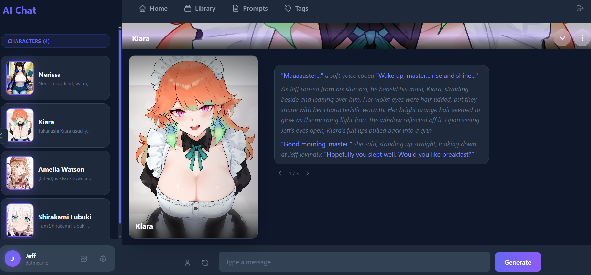
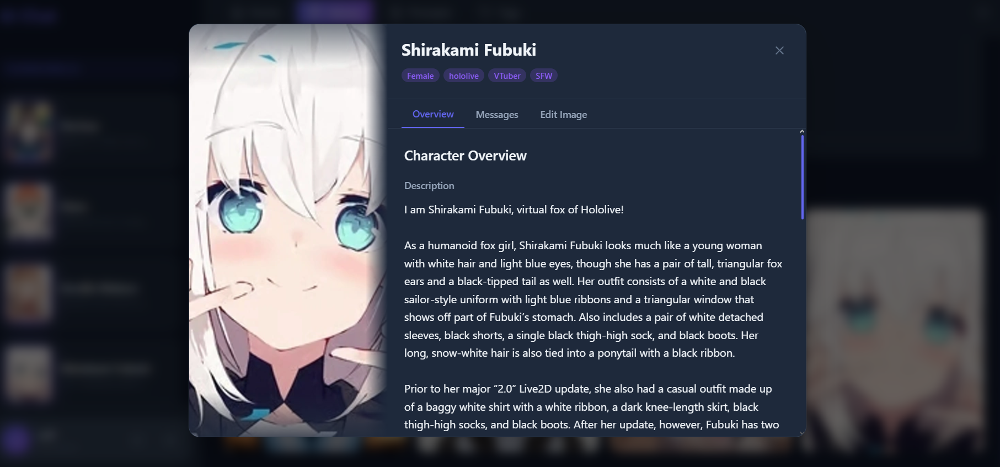

# ChatterBox

A Discord-like AI character chat application where you and multiple AI characters interact in shared text channels. Characters have their own schedules, personalities, and naturally engage in group conversations.

Derived from an AI chat template I made. Check out the original: https://github.com/ForgottenHistory/Cupid-AI



## Features

### Group Text Channels
- **Discord-style chat** - Shared channels where you and multiple AI characters talk together
- **Natural conversations** - Characters respond to each other, not just you
- **Message splitting** - AI responses split on newlines into separate messages for realistic chat flow
- **Typing indicators** - See who's typing with staggered message delivery
- **\*ignore\* system** - Characters can naturally leave conversations when they lose interest

### Engagement System
- **Dynamic engagement** - Characters roll to join conversations based on their schedule status
- **Engagement duration** - Characters stay active for configurable durations before disengaging
- **Proactive messages** - Characters can start new topics with varied opener styles
- **Double-text chance** - Same character can send multiple messages in a row
- **Name mentions** - Mention a character's name and they'll be prioritized to respond
- **1% join chance** - Random characters can spontaneously join active conversations
- **Persistent state** - Engagement survives page navigation

### Character System
- **Character Cards** - Import V1/V2 character card formats with image extraction from PNG metadata
- **Character Profile** - Edit description, personality, and image settings with AI-powered rewrite
- **Weekly Schedules** - LLM-generated schedules with online/away/busy/offline statuses and activities
- **Member Sidebar** - Live status display with clickable profile popovers showing current activity
- **Schedule-aware behavior** - Characters' availability and response style reflect their current activity

### Chat Features
- **Message controls** - Edit, delete, copy, and view reasoning on hover (Discord-style toolbar)
- **Export chat** - Download conversation as .txt file
- **Conversation history compaction** - Group same-sender messages to save tokens
- **Name primer** - Append character name to prompts for better model guidance
- **Post-processing** - Strip other characters' lines, handle name prefixes

### Behaviour Settings
- **Channel chat frequency** - Dual-range slider for response timing
- **Engagement chances** - Per-status probability (online/away/busy)
- **Engagement duration** - Per-status timer before disengaging
- **Engagement cooldown** - Prevent immediate re-engagement after leaving
- **Engagement roll interval** - How often the system checks for new participants
- **Double text chance** - Range for same-speaker repetition
- **Join chance per message** - Spontaneous character entry rate
- **Roleplay name primer** - Toggle for response guidance
- **Compact history** - Toggle for token-saving message grouping

### DM Chat (from template)
- **1:1 conversations** - Private chats with individual characters
- **Swipes** - Generate alternative responses
- **Impersonate** - Generate responses as your character
- **Reasoning display** - View LLM thinking when available
- **Conversation branching** - Create alternate conversation paths

### Layout & Appearance
- **Sidebar modes** - Switch between Channels and DMs views
- **DM chat layouts** - Bubble style or Discord style
- **Avatar styles** - Circle or rounded rectangle
- **Dark theme** - Teal/violet ChatterBox theme
- **Custom scrollbars** - Styled to match the theme

### Multi-LLM Architecture
- **Chat LLM** - Character conversations
- **Content LLM** - Description/personality generation and rewriting
- **Decision LLM** - Pre-processing decisions
- **Image LLM** - Danbooru tag generation for Stable Diffusion

### LLM Configuration
- **3 Providers** - OpenRouter, Featherless, and NanoGPT
- **Model rotation** - Pool of models with random selection per request
- **LLM Presets** - Save and load configurations
- **Reasoning support** - Extended thinking for supported models
- **Extended sampling** - Top K, Min P, repetition penalty (Featherless/NanoGPT)

### Image Generation
- **Stable Diffusion** - Generate images via local SD WebUI API
- **Global Tag Library** - Tags for AI to choose from dynamically
- **Per-character settings** - Image tags, contextual tags, prompt overrides
- **ADetailer** - Optional face enhancement

### Other
- **File-based prompts** - Edit system prompts in `data/prompts/` or through the UI
- **Schedule prompts** - Customizable schedule generation templates
- **Description cleanup** - AI rewrites character descriptions into structured format
- **Personality generation** - Generate third-person summaries from descriptions
- **Debug tools** - Generate messages, engage characters, clear engagement
- **Logging** - Prompt/response logs per LLM type



## Tech Stack

- **Framework**: SvelteKit 2 with Svelte 5
- **Language**: TypeScript
- **Styling**: Tailwind CSS 4
- **Database**: SQLite with Drizzle ORM
- **LLM Providers**: OpenRouter, Featherless, NanoGPT
- **Image Generation**: Stable Diffusion WebUI API

## Setup

1. Clone the repository
2. Install dependencies:
   ```bash
   npm install
   ```
3. Copy `.env.example` to `.env` and add your API keys:
   ```
   OPENROUTER_API_KEY=sk-or-v1-...
   FEATHERLESS_API_KEY=...        # optional
   NANOGPT_API_KEY=...            # optional
   SD_SERVER_URL=http://127.0.0.1:7860  # optional, for image generation
   ```
4. Initialize the database:
   ```bash
   npm run db:push
   ```
5. Start the dev server:
   ```bash
   npm run dev
   ```

## Commands

```bash
npm run dev        # Start dev server
npm run build      # Production build
npm run check      # Type check
npm run lint       # Run ESLint
npm run db:push    # Push schema to database
npm run db:studio  # Open Drizzle Studio
```

## Project Structure

- `src/routes/channel/[id]/` - Channel chat page with engagement system
- `src/routes/chat/[id]/` - DM chat page
- `src/lib/components/channel/` - Channel UI components (chat, header, members sidebar)
- `src/lib/components/layout/` - Layout components (sidebar, nav, modals)
- `src/lib/components/character-profile/` - Character profile tabs
- `src/lib/server/` - Server-side services (LLM, auth, database)
- `src/routes/api/` - REST API endpoints
- `data/prompts/` - Customizable prompt templates (gitignored)

## License

MIT
